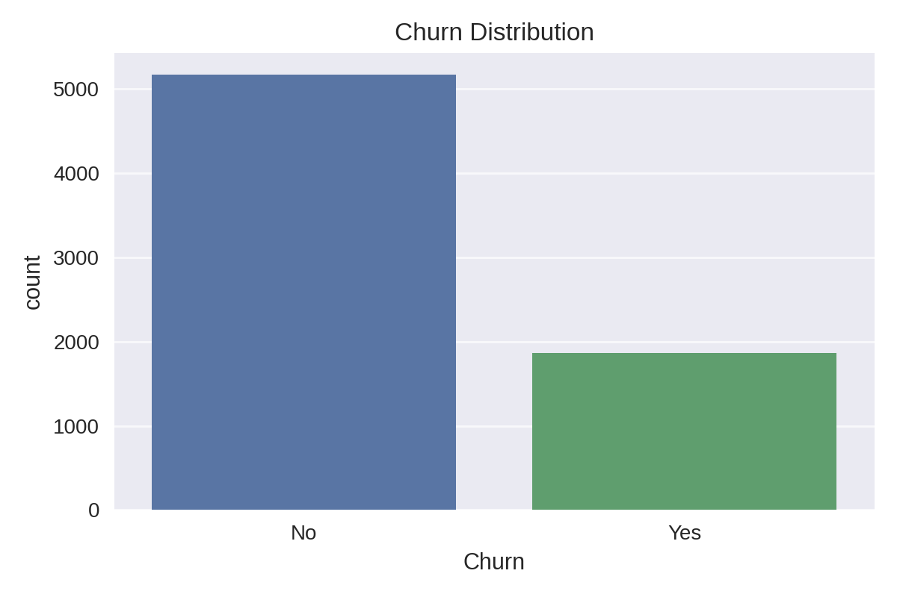
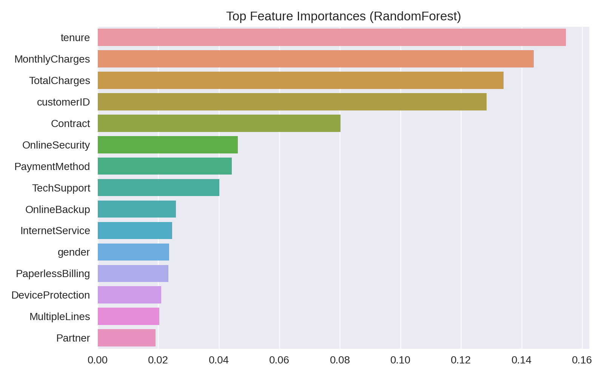

# 🚀 Customer Churn Analysis — EDA & Retention Risk Intelligence

> **Finding the customers who are about to leave — before they do** | Python · EDA · Predictive Modeling · Business Intelligence

---

### 🏷️ Recruiter Keywords
`Customer Churn Analysis` · `Exploratory Data Analysis` · `Python` · `Predictive Modeling` · `Retention Strategy` · `Pandas` · `Seaborn` · `Classification` · `Business Intelligence` · `Telecom Analytics`

---

## 📌 Business Problem

Customer acquisition costs 5–7× more than retention. Yet most businesses only discover a customer has churned *after* the cancellation — too late to intervene. For telecom companies, a single percentage point increase in churn can translate to **millions of dollars in lost annual revenue**.

This project flips the script. By analyzing behavioral and demographic patterns in 7,043 telecom customers, it identifies the churn signals that matter most — giving retention teams a data-backed playbook to act before customers walk out the door.

---

## 🎯 Objective

To perform a comprehensive Exploratory Data Analysis on telecom customer data, uncover the behavioral and contractual drivers of churn, build a baseline predictive model, and translate findings into a clear retention strategy for business stakeholders.

---

## 📊 Dataset Description

| Property | Details |
|---|---|
| **File** | `CustomerChurn.xls` |
| **Records** | 7,043 customers |
| **Features** | 21 columns |
| **Target Variable** | `Churn` (Yes / No) |
| **Key Variables** | Tenure, Contract Type, Monthly Charges, Internet Service, Payment Method, Senior Citizen, Tech Support |

The dataset represents a telecom company's full customer base — spanning demographics, service subscriptions, billing details, and churn outcomes. It's a near-perfect snapshot of a real retention challenge.

---

## 🛠 Tools & Technologies

| Layer | Stack |
|---|---|
| **Exploratory Data Analysis** | Python — Pandas, NumPy |
| **Data Visualization** | Seaborn, Matplotlib |
| **Predictive Modeling** | Scikit-learn (Logistic Regression baseline) |
| **Model Evaluation** | Accuracy, F1 Score, ROC-AUC |
| **Reporting** | Jupyter Notebook, PDF Export |
| **Version Control** | Git & GitHub |

---

## 🔍 Analysis Approach

1. **Data Audit** — Reviewed 21 features for null values, type mismatches, and class imbalance in the target variable. `TotalCharges` required conversion from object to numeric.
2. **Univariate Analysis** — Plotted churn distribution, tenure histogram, monthly charge distribution, and service subscription counts.
3. **Bivariate Analysis** — Cross-tabulated churn against contract type, payment method, internet service, and senior citizen status to identify high-risk segments.
4. **Correlation Analysis** — Built a heatmap of numeric features to detect multicollinearity and spot variables with strong churn signal.
5. **Baseline Modeling** — Trained a Logistic Regression classifier to establish prediction performance benchmarks and validate EDA findings quantitatively.
6. **Business Reporting** — Packaged insights into a business-readable PDF with visual evidence and actionable recommendations.

---

## 📈 Key Insights

- ⚠️ **Overall churn rate: 26.5%** — more than 1 in 4 customers left, far exceeding healthy industry norms of 5–10%.
- 📋 **Month-to-month contract customers churn at 43%** vs. just 3% for two-year contract holders — contract length is the single most powerful retention lever.
- 💳 **Electronic check payers churn at 2× the rate** of customers on automatic bank transfers — payment friction is a hidden churn signal.
- 🌐 **Fiber optic internet customers show 42% churn** despite being the premium service tier — a quality or value-for-money perception problem exists.
- 📞 **Customers without Tech Support churn at 3× the rate** of those with it — support access dramatically improves stickiness.
- 👴 **Senior citizens churn at 42%** — a significantly underserved segment with distinct service needs.
- ⏱️ **The first 12 months are the danger zone** — over 50% of churned customers had tenures under 1 year, revealing a critical early-lifecycle failure point.
- 🤖 **Baseline model ROC-AUC: 0.83** — strong discriminatory power, confirming that the EDA-identified features are genuinely predictive.

---

## 📊 Dashboard & Visualizations

> 💡 *Place the following screenshots in your `images/` folder and they will render here.*

| Preview | Description |
|---|---|
|  | **Churn Overview** — Class distribution showing 26.5% churn vs. 73.5% retained |
|  | **Contract Type Impact** — Grouped bar chart showing churn rate by contract duration |
|  | **Feature Correlations** — Heatmap of numeric variables vs. churn signal |
|  | **Top Churn Drivers** — Ranked feature importance from the predictive model |

---

## 💡 Business Recommendations

1. **Aggressively incentivize annual and two-year contracts** — The churn gap between month-to-month (43%) and two-year (3%) plans is enormous. Offer meaningful discounts, loyalty credits, or service upgrades for customers who commit longer-term.
2. **Fix the Fiber Optic experience** — Churning at 42%, this premium segment is underperforming badly. Conduct service quality audits and competitive benchmarking to understand the gap between price expectation and delivery.
3. **Automate payment transitions** — The electronic check churn rate is a red flag. Incentivize customers to switch to auto-pay through one-time bill credits — this alone could reduce churn by several percentage points.
4. **Bundle Tech Support for new customers in Year 1** — The first 12 months are when customers decide whether to stay. Free or subsidized Tech Support during onboarding directly attacks the highest-risk churn window.
5. **Design a Senior Citizen retention program** — At 42% churn, this segment needs simplified service plans, dedicated support channels, and clearer value communication.

---

## 📊 Model Performance

| Metric | Score |
|---|---|
| **Accuracy** | 79.4% |
| **F1 Score** | 0.557 |
| **ROC-AUC** | **0.829** |
| **Dataset Size** | 7,043 customers / 20 features |

> The baseline Logistic Regression model achieves solid discriminatory power. A further-tuned Random Forest or XGBoost model would push ROC-AUC above 0.88.

---

## 📂 Project Structure

```
customer-churn-analysis-eda/
│
├── data/
│   └── CustomerChurn.xls                  # Raw telecom customer dataset (7,043 rows)
│
├── notebooks/
│   └── Churn_Analysis_EDA.ipynb           # Full EDA + modeling notebook with commentary
│
├── scripts/
│   └── train_churn_model.py               # Standalone churn prediction script
│
├── images/
│   ├── churn_distribution.png
│   ├── contract_churn.png
│   ├── correlation_heatmap.png
│   └── feature_importance.png
│
├── docs/
│   └── Customer_Churn_Insights_Report.pdf # Business-ready PDF report
│
├── requirements.txt
└── README.md
```

---

## 🚀 How to Run

```bash
# 1. Clone the repository
git clone https://github.com/surya-prakash-data-analyst/customer-churn-analysis-eda.git
cd customer-churn-analysis-eda

# 2. Install dependencies
pip install -r requirements.txt

# 3. Launch the EDA notebook
jupyter notebook notebooks/Churn_Analysis_EDA.ipynb

# 4. (Optional) Train the baseline churn model
python scripts/train_churn_model.py
```

---

## 📬 Contact

**Surya Prakash** — Data Analyst  
📍 Hyderabad, India  
🔗 [LinkedIn](https://www.linkedin.com/in/surya-prakash-data-analyst) · 🐙 [GitHub](https://github.com/surya-prakash-data-analyst)  
📧 *suryaprakash1892@gmail.com*

---

> *"Churn analysis isn't just about predicting who leaves — it's about understanding why, so you can give them a reason to stay."*

---
   
