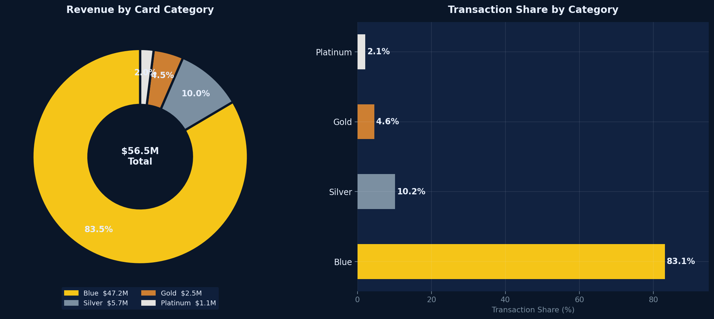
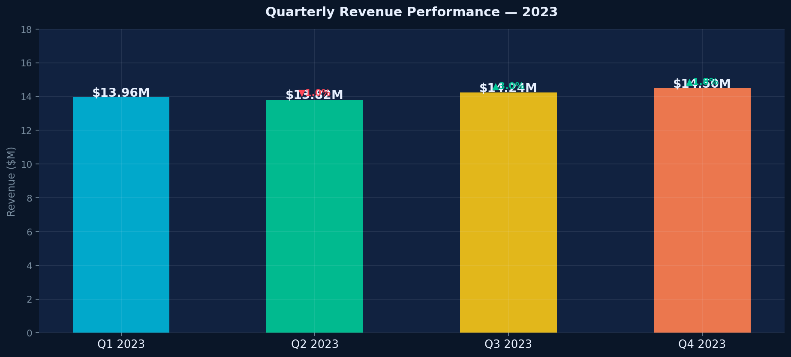
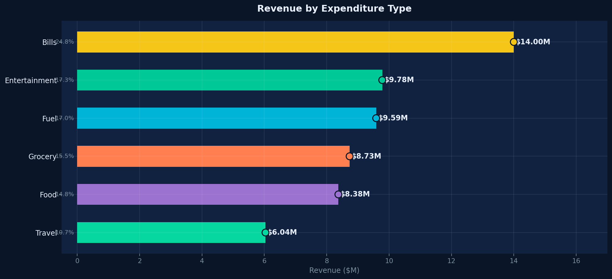
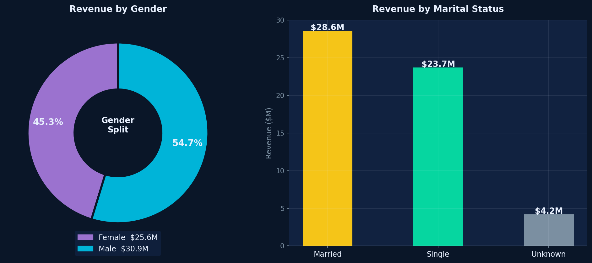
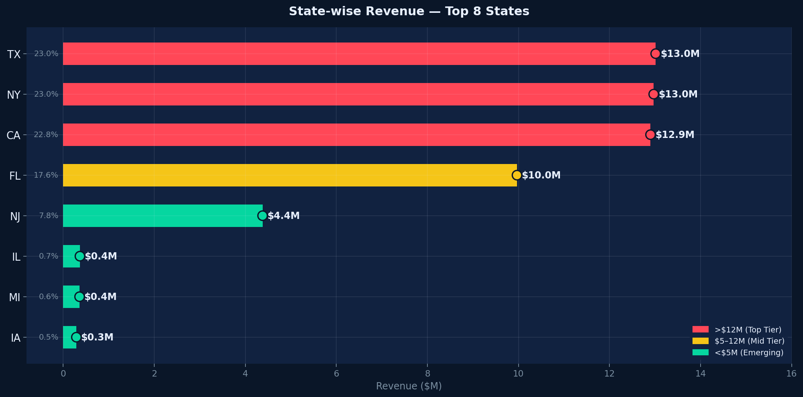
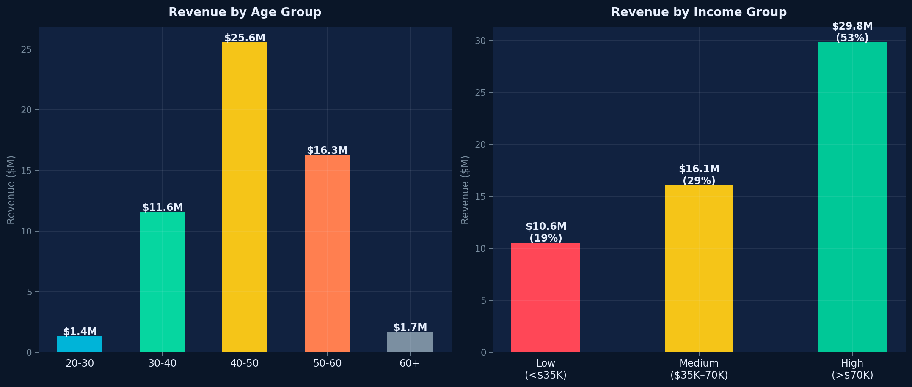
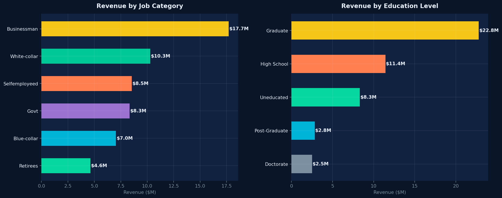
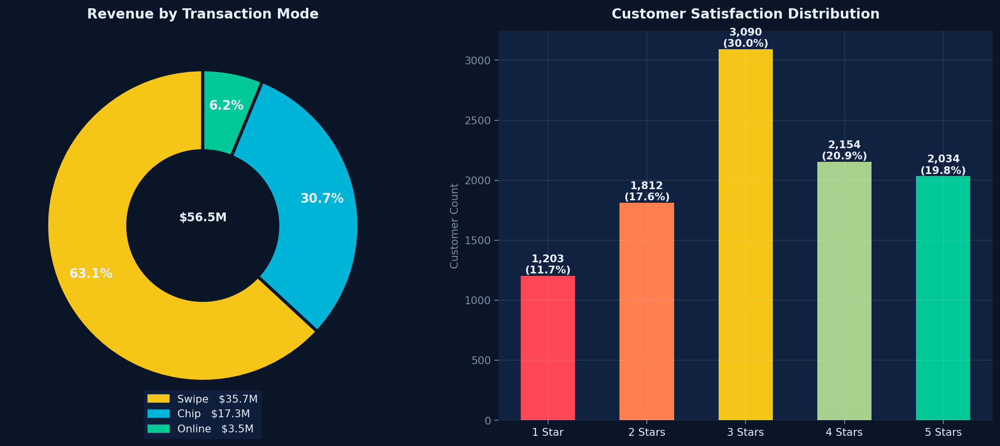
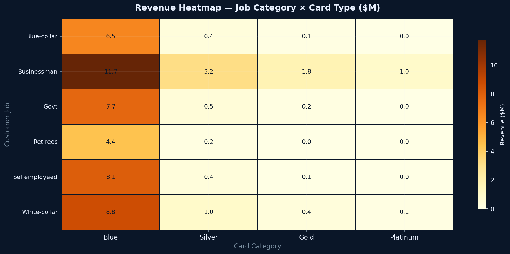

# 💳 Credit Card Financial Dashboard
### Weekly Performance & Customer Intelligence — SQL · Power BI · Python · DAX

> **Real-time insights into $56.5M of credit card operations** | PostgreSQL · Power BI · EDA · Data Visualization

---


---

### 🏷️ Keywords
`Financial Analytics` · `Credit Card Dashboard` · `SQL Database` · `Power BI DAX` · `KPI Analysis` · `Exploratory Data Analysis` · `Data Visualization` · `Business Intelligence` · `Data Cleaning & Transformation` · `Predictive Modeling`

---

## 📌 Business Problem

Credit card operations generate enormous volumes of transactional data every week. Without a structured analytics layer, patterns in delinquency, utilization, and revenue concentration remain invisible until they become problems — missed revenue targets, growing bad debt, or customer churn that went undetected.

This project builds a **real-time weekly dashboard** ingesting data from a PostgreSQL database, enabling stakeholders to track $56.5M in annual revenue, identify high-value customer segments, and act on delinquency signals before they compound.

---

## 🎯 Objective

Develop a comprehensive credit card weekly dashboard that provides real-time insights into key performance metrics and trends, enabling stakeholders to monitor and analyze credit card operations effectively — from transaction patterns to customer segmentation to delinquency risk.

---

## 📊 Key Performance Indicators — YTD 2023

| KPI | Value |
|---|---|
| **Total Revenue** | $56.5M |
| **Total Interest Earned** | $8.0M |
| **Total Transaction Amount** | $45.5M |
| **Total Transaction Volume** | 655,651 |
| **Activation Rate (30-day)** | 57.5% |
| **Delinquent Rate** | 6.06% |
| **Week 53 WoW Revenue Change** | ▲ +28.8% |

> Male: $31M · Female: $26M · Blue+Silver = 93% transactions · TX+NY+CA = 68% revenue

---

## 📋 Dataset Description

| Table | Records | Key Fields |
|---|---|---|
| `cc_detail` | 10,293 (base + Week-53) | Card_Category, Annual_Fees, Credit_Limit, Total_Trans_Amt, Interest_Earned, Avg_Utilization_Ratio |
| `cust_detail` | 10,293 unique customers | Customer_Age, Gender, Income, Education_Level, Customer_Job, State, Satisfaction_Score |

**Derived Feature:** `Revenue = Annual_Fees + Total_Trans_Amt + Interest_Earned`

---

## 🛠 Tools & Technologies

| Layer | Stack |
|---|---|
| **Database** | PostgreSQL — CREATE TABLE, COPY, datestyle configuration |
| **Dashboard** | Power BI — DAX calculated columns, CALCULATE/FILTER measures, KPI cards |
| **EDA & Visualization** | Python — Pandas, NumPy, Matplotlib, Seaborn |
| **Data Cleaning** | Revenue derivation, Age/Income group segmentation, Week number extraction |
| **Version Control** | Git & GitHub |

---

## ⚙️ Key DAX Measures

```dax
Revenue = annual_fees + total_trans_amt + interest_earned

Current_week_Revenue = CALCULATE(SUM(Revenue),
  FILTER(ALL(cc_detail), week_num2 = MAX(week_num2)))

Previous_week_Revenue = CALCULATE(SUM(Revenue),
  FILTER(ALL(cc_detail), week_num2 = MAX(week_num2)-1))

AgeGroup = SWITCH(TRUE(),
  customer_age < 30, "20-30",  customer_age < 40, "30-40",
  customer_age < 50, "40-50",  customer_age < 60, "50-60", "60+")

IncomeGroup = SWITCH(TRUE(),
  income < 35000, "Low",  income < 70000, "Med", "High")
```

---

## 🔍 Analysis Approach

1. **SQL Database Setup** — Created PostgreSQL database, defined cc_detail and cust_detail tables, imported 10,108 base records + 185 Week-53 additions via COPY command.
2. **DAX Feature Engineering** — Built AgeGroup, IncomeGroup, Revenue, Current/Previous Week Revenue measures in Power BI for dynamic WoW comparison.
3. **Customer Segmentation EDA** — Analyzed revenue by gender, age group, income tier, job category, education, and marital status.
4. **Transaction Analysis** — Decomposed revenue by card category, expenditure type, and payment mode (Chip/Swipe/Online).
5. **Geographic Intelligence** — Mapped state-level revenue concentration across TX, NY, CA, FL.
6. **Risk Monitoring** — Tracked 6.06% delinquency rate and 57.5% activation rate for weekly operational alerting.

---

## 📈 Key Insights

- 💳 **Blue card drives 83.1% of all transactions and $47.2M revenue** — single-tier concentration makes Blue card retention the #1 business priority
- 🏙️ **TX + NY + CA = 68% of total revenue** — three states generating ~$13M each, revealing saturated metro markets
- 👔 **Businessmen contribute $17.7M (31.3%)** — the dominant occupation segment with highest credit utilization
- 📅 **Age 40–50 is the top revenue cohort at $25.6M** — mid-career earners with the highest card spend per customer
- 💰 **High-income customers drive 52.8% of revenue** — premium segment is most valuable and most underserved
- 🧾 **Bills ($14.0M) is the top expense category** — utility and recurring payments are the primary card use case
- 📲 **Online transactions = only 6.2% of revenue** — massive digital engagement gap vs industry norms
- ⭐ **29.3% customers rated 1–2 stars** — satisfaction issues correlate with delinquency risk

---

## 📊 Dashboard & Visualizations

### 🔢 KPI Summary Banner


### 🃏 Revenue by Card Category


### 📅 Quarterly Revenue Performance


### 🛒 Revenue by Expense Type


### 👥 Gender & Marital Status Analysis


### 🗺️ State-wise Revenue — Top 8 States


### 📊 Age Group & Income Group Segmentation


### 💼 Revenue by Job & Education Level


### 💳 Transaction Mode & Customer Satisfaction


### 🔥 Revenue Heatmap — Job × Card Type


---

## 💡 Business Recommendations

1. **Protect Blue card retention above all else.** With 83.1% of transactions and $47.2M revenue, implement proactive engagement — cashback milestones and fee waivers for high-utilization holders.
2. **Expand aggressively into FL, IL, and MI.** TX/NY/CA are saturated. Florida at $10M is the nearest growth lever; IL and MI are sub-$0.4M with significant runway.
3. **Target 40–50 year old, high-income businessmen for Gold/Platinum upsells.** This segment has the highest revenue per customer and the greatest upgrade potential.
4. **Address the 29.3% low-satisfaction cluster urgently.** Correlate 1–2 star ratings with Delinquent_Acc flag to build a churn early-warning model.
5. **Invest in online transaction infrastructure.** Digital usage at 6.2% is far below industry norms. A mobile-first roadmap could shift behavior and reduce fraud risk.

---

## 📂 Project Structure

```
credit-card-financial-dashboard/
│
├── 📁 dashboard/
│   └── Credit_Card_Report.pbix
│
├── 📁 data/
│   ├── credit_card.csv          ← cc_detail base (10,108 rows)
│   ├── customer.csv             ← cust_detail base (10,108 rows)
│   ├── cc_add.csv               ← Week-53 additions (185 rows)
│   └── cust_add.csv             ← Week-53 customer additions
│
├── 📁 scripts/
│   └── SQL_Query_Financial_Dashboard.sql
│
├── 📁 notebooks/
│   └── Credit_Card_EDA.ipynb
│
├── 📁 images/                   ← 10 chart PNGs
│   ├── 01_kpi_banner.png
│   ├── 02_card_category.png
│   ├── 03_quarterly_revenue.png
│   ├── 04_expense_type.png
│   ├── 05_gender_marital.png
│   ├── 06_state_revenue.png
│   ├── 07_age_income.png
│   ├── 08_job_education.png
│   ├── 09_mode_satisfaction.png
│   └── 10_heatmap_job_card.png
│
├── 📁 docs/
│   └── Credit_Card_Financial_Weekly_Dashboard_Report.pdf
│
├── requirements.txt
└── README.md
```

---

## 🚀 How to Run

```bash
# 1. Clone the repository
git clone https://github.com/surya-prakash-data-analyst/credit-card-financial-dashboard.git
cd credit-card-financial-dashboard

# 2. Set up PostgreSQL database
psql -U postgres -c "CREATE DATABASE ccdb;"
psql -U postgres -d ccdb -f scripts/SQL_Query_Financial_Dashboard.sql

# 3. Install Python dependencies
pip install -r requirements.txt

# 4. Run EDA notebook
jupyter notebook notebooks/Credit_Card_EDA.ipynb

# 5. Open Power BI dashboard
# Power BI Desktop → File → Open → dashboard/Credit_Card_Report.pbix
```

---

## 📬 Contact

**Surya Prakash** — Data Analyst  
📍 Hyderabad, India  
🔗 [LinkedIn](https://www.linkedin.com/in/surya-prakash-data-analyst) · 🐙 [GitHub](https://github.com/surya-prakash-data-analyst)
📧 suryaprakash1892@gmail.com
---

> *"Financial dashboards don't just show what happened — they show where the risk is building before it becomes a problem. That's what this project was built to do."*

---
*Built with real data · 10,293 customers · $56.5M revenue · SQL + Power BI + Python · Insights verified.*
